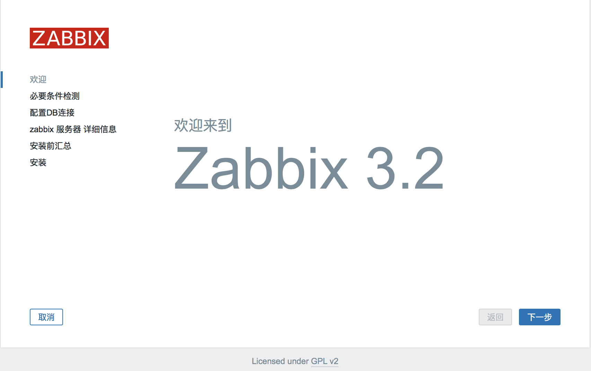
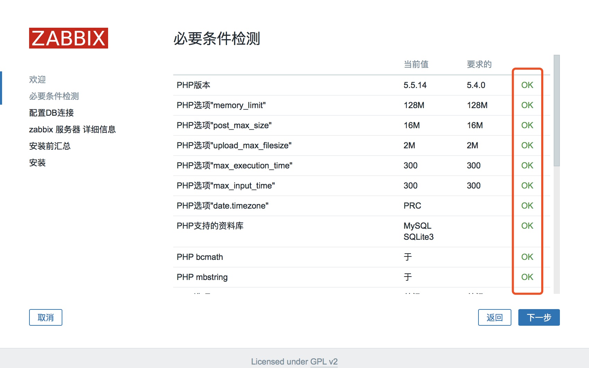
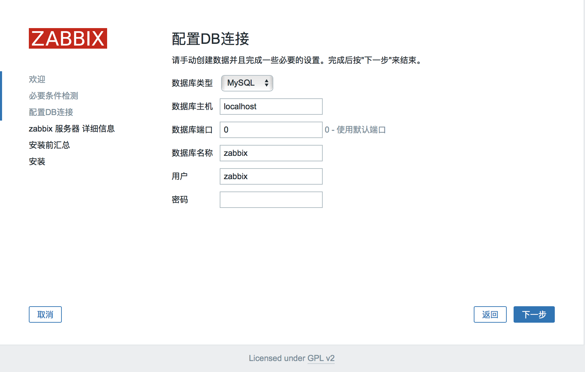
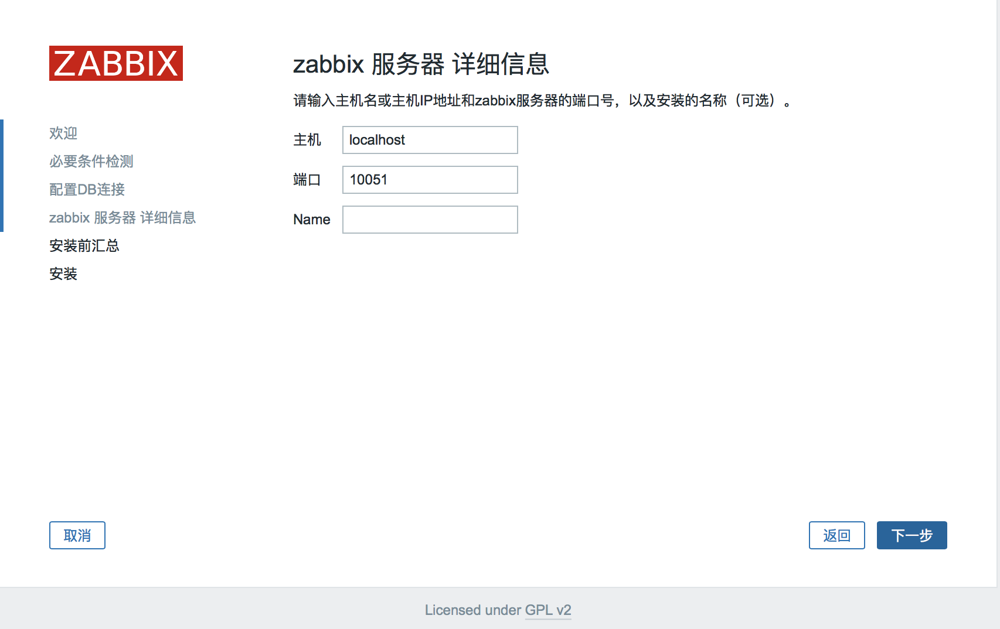
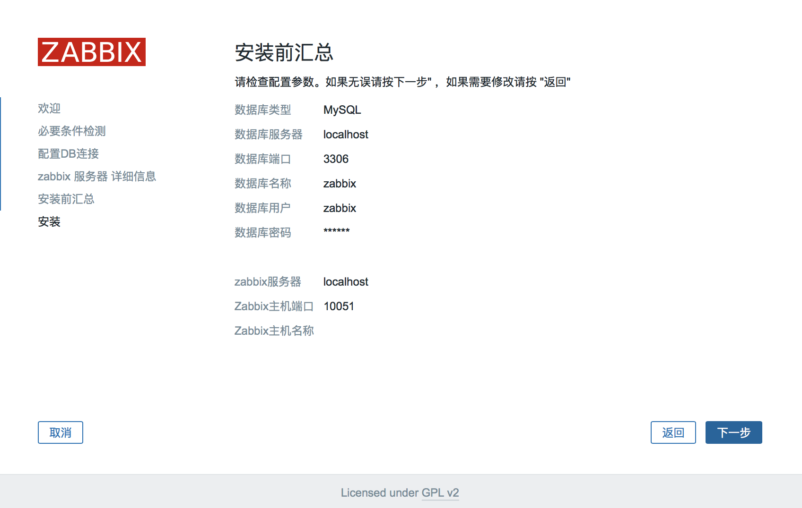
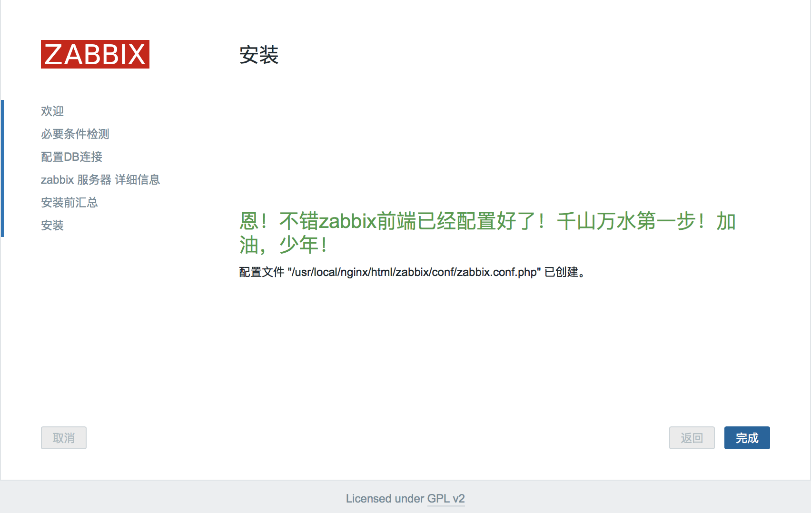

[TOC]

* * *

# ZABBIX 安装

## 环境准备
	Linux: CentOS Linux release 7.3.1611 (Core) 
	zabbix: 3.2.6
    nginx: 1.12.0
    php: 5.5.14
    mysql: 5.6.19
## 系统约定
    软件源代码包存放位置：/usr/local/src
    源码包编译安装位置：/usr/local/软件名字

## 依赖包安装
	# yum install -y apr* autoconf automake bison bzip2 bzip2* cloog-ppl compat* cpp curl curl-devel fontconfig fontconfig-devel freetype freetype* freetype-devel gcc gcc-c++ gtk+-devel gd gettext gettext-devel glibc kernel kernel-headers keyutils keyutils-libs-devel krb5-devel libcom_err-devel libpng libpng-devel libjpeg* libsepol-devel libselinux-devel libstdc++-devel libtool* libgomp libxml2 libxml2-devel libXpm* libxml* libtiff libtiff* make mpfr ncurses* ntp openssl openssl-devel patch pcre-devel perl php-common php-gd policycoreutils telnet t1lib t1lib* nasm nasm* wget zlib-devel vim

## 安装Mysql
### 安装cmake
	# cd /usr/local/src
    # wget http://www.cmake.org/files/v2.8/cmake-2.8.11.2.tar.gz
    # tar zxvf cmake-2.8.11.2.tar.gz
    # cd cmake-2.8.11.2
    # ./configure
    # make
    # make install

### 安装mysql
	添加mysql组
	# groupadd mysql
    创建用户mysql并加入到mysql组，不允许mysql用户直接登录系统
    # useradd -g mysql mysql -s /bin/false
    创建MySQL数据库存放目录
    # mkdir -p /data/mysql
    设置MySQL数据库存放目录权限
    # chown -R mysql:mysql /data/mysql
    创建MySQL安装目录
    # mkdir -p /usr/local/mysql
    # cd /usr/local/src
    # tar zxvf mysql-5.6.19.tar.gz
    # cd mysql-5.6.19
    配置
    # cmake . -DCMAKE_INSTALL_PREFIX=/usr/local/mysql -DMYSQL_DATADIR=/data/mysql -DSYSCONFDIR=/etc
	# make
    # make install
    删除系统默认的配置文件（如果默认没有就不用删除）
    # rm -f /etc/my.cnf
    # ln -s /usr/local/mysql/my.cnf /etc/my.cnf
    添加开机自启动
    # cp ./support-files/mysql.server /etc/rc.d/init.d/mysqld
    # chmod 755 /etc/init.d/mysqld
    # chkconfig mysqld on
    编辑如下文件并保存退出
    # vim /etc/rc.d/init.d/mysqld
    basedir=/usr/local/mysql #MySQL程序安装路径
    datadir=/data/mysql #MySQl数据库存放目录
    编辑profile文件，在最后一行追加
    # vim /etc/profile
    export PATH=$PATH:/usr/local/mysql/bin
    # source /etc/profile
    # ln -s /usr/local/mysql/lib/mysql /usr/lib/mysql
    # ln -s /usr/local/mysql/include/mysql /usr/include/mysql
 	# mkdir -p /var/lib/mysq
	# ln -s /tmp/mysql.sock /var/lib/mysql/mysql.sock
    设置root密码
    #mysql -u root
    > grant all privileges on *.* to 'root'@'localhost' identified by '123456';
    > grant all privileges on *.* to 'root'@'192.168.10.171' identified by '123456';

## 安装Nginx
### 安装pcre
	# wget 
    # mkdir /usr/local/pcre
    # tar zxvf pcre-8.35.tar.gz
    # cd pcre-8.35
    # ./configure --prefix=/usr/local/pcre
    # make
    # make install
### 安装openssl
	# wget 
    # mkdir /usr/local/openssl
    # tar zxvf openssl-1.0.1h.tar.gz
    # cd openssl-1.0.1h
    # ./config --prefix=/usr/local/openssl
    # make
    # make install
    编辑profile文件，最后一行追加
    # vim /etc/profile
      export PATH=$PATH:/usr/local/openssl/bin
    # source /etc/profile
### 安装zlib
	wget
    # mkdir /usr/local/zlib
    # tar zvxf zlib-1.2.8.tar.gz
    # cd zlib-1.2.8
    # ./configure --prefix=/usr/local/zlib
    # make
    # make install
### 安装Nginx
	# wget http://nginx.org/download/nginx-1.12.0.tar.gz
    # tar zvxf  nginx-1.12.0.tar.gz
    # groupadd www
    # useradd -g www www -s /bin/false
    # cd nginx-1.12.0
    # ./configure --prefix=/usr/local/nginx --without-http_memcached_module --user=www --group=www --with-http_stub_status_module --with-http_ssl_module --with-http_gzip_static_module --with-openssl=/usr/local/src/openssl-1.0.1h --with-zlib=/usr/local/src/zlib-1.2.8 --with-pcre=/usr/local/src/pcre-8.35
    # make
    # make install
    
## 安装PHP

### 安装yasm
	# wget 
    # tar zxvf yasm-1.2.0.tar.gz
    # cd yasm-1.2.0
    # ./configure
    # make 
    # make install
### 安装libmcrypt
	# wget 
    # tar zxvf libmcrypt-2.5.8.tar.gz
    # cd libmcrypt-2.5.8
    # ./configure
    # make
    # make install
    
### 安装libvpx
	# wget 
    # tar xvf libvpx-v1.3.0.tar.bz2
    # cd libvpx-v1.3.0
    # ./configure --prefix=/usr/local/libvpx --enable-shared --enable-vp9
    # make
    # make install
    
### 安装tiff
	# wget
    # tar  zxvf tiff-4.0.3.tar.gz
    # cd tiff-4.0.3
    # ./configure --prefix=/usr/local/tiff --enable-shared
    # make
    # make install
    
### 安装libpng
	# wget 
    # tar zxvf libpng-1.6.12.tar.gz
    # cd libpng-1.6.12
    # ./configure --prefix=/usr/local/libpng --enable-shared
    # make
    # make install
    
### 安装freetype
	# wget
    # zxvf freetype-2.5.3.tar.gz
    # cd freetype-2.5.3
    # ./configure --prefix=/usr/local/freetype --enable-shared
    # make
    # make install
    
### 安装jpeg
	# wget
    # tar zxvf jpegsrc.v9a.tar.gz
    # cd jpeg-9a
    # ./configure --prefix=/usr/local/jpeg --enable-shared
    # make
    # make install

### 安装libgd
	# wget
    # tar zxvf libgd-2.1.0.tar.gz
    # cd libgd-2.1.0
    # ./configure --prefix=/usr/local/libgd --enable-shared --with-jpeg=/usr/local/jpeg --with-png=/usr/local/libpng --with-freetype=/usr/local/freetype --with-fontconfig=/usr/local/freetype --with-xpm=/usr/ --with-tiff=/usr/local/tiff --with-vpx=/usr/local/libvpx
    # make
	# make install
    
### 安装t1lib
	# wget
    # tar zxvf t1lib-5.1.2.tar.gz
    # cd t1lib-5.1.2
    # ./configure --prefix=/usr/local/t1lib --enable-shared
    # make without_doc
    # make install
    
### 安装php
	# cp -frp /usr/lib64/libXpm.so* /usr/lib/
    # wget
    # tar -zvxf php-5.5.14.tar.gz
    # php-5.5.14
    # export LD_LIBRARY_PATH=/usr/local/libgd/lib
    # ./configure --prefix=/usr/local/php --with-config-file-path=/usr/local/php/etc --with-mysql=/usr/local/mysql --with-mysqli=/usr/local/mysql/bin/mysql_config --with-mysql-sock=/tmp/mysql.sock --with-pdo-mysql=/usr/local/mysql --with-gd --with-png-dir=/usr/local/libpng --with-jpeg-dir=/usr/local/jpeg --with-freetype-dir=/usr/local/freetype --with-xpm-dir=/usr/ --with-vpx-dir=/usr/local/libvpx/ --with-zlib-dir=/usr/local/zlib --with-t1lib=/usr/local/t1lib --with-iconv --enable-libxml --enable-xml --enable-bcmath --enable-shmop --enable-sysvsem --enable-inline-optimization --enable-opcache --enable-mbregex --enable-fpm --enable-mbstring --enable-ftp --enable-gd-native-ttf --with-openssl --enable-pcntl --enable-sockets --with-xmlrpc --enable-zip --enable-soap --without-pear --with-gettext --enable-session --with-mcrypt --with-curl --enable-ctype
    # make
    # make install
    # cp php.ini-production /usr/local/php/etc/php.ini
    # rm -f /etc/php.ini
    # ln -s /usr/local/php/etc/php.ini /etc/php.ini
    # cp /usr/local/php/etc/php-fpm.conf.default /usr/local/php/etc/php-fpm.conf
    # ln -s /usr/local/php/etc/php-fpm.conf /etc/php-fpm.conf
    编辑php配置文件，参照如下修改
    # vim /usr/local/php/etc/php-fpm.conf
      user = www #设置php-fpm运行账号为www
      group = www #设置php-fpm运行组为www
      pid = run/php-fpm.pid #取消前面的分号
    设置 php-fpm开机启动
    # cp /usr/local/src/php-5.5.14/sapi/fpm/init.d.php-fpm /etc/rc.d/init.d/php-fpm
    # chmod +x /etc/rc.d/init.d/php-fpm
    # chkconfig php-fpm on
   	编辑PHP配置文件，修改以下内容
    # vim /usr/local/php/etc/php.ini
       找到：disable_functions =

	   修改为：disable_functions = passthru,exec,system,chroot,scandir,chgrp,chown,shell_exec,proc_open,proc_get_status,ini_alter,ini_alter,ini_restore,dl,openlog,syslog,readlink,symlink,popepassthru,stream_socket_server,escapeshellcmd,dll,popen,disk_free_space,checkdnsrr,checkdnsrr,getservbyname,getservbyport,disk_total_space,posix_ctermid,posix_get_last_error,posix_getcwd, posix_getegid,posix_geteuid,posix_getgid, posix_getgrgid,posix_getgrnam,posix_getgroups,posix_getlogin,posix_getpgid,posix_getpgrp,posix_getpid, posix_getppid,posix_getpwnam,posix_getpwuid, posix_getrlimit, posix_getsid,posix_getuid,posix_isatty, posix_kill,posix_mkfifo,posix_setegid,posix_seteuid,posix_setgid, posix_setpgid,posix_setsid,posix_setuid,posix_strerror,posix_times,posix_ttyname,posix_uname
    --设置时区   
    找到：;date.timezone =
    修改为：date.timezone = PRC
    --禁止显示php版本的信息
    找到：expose_php = On
    修改为：expose_php = Off
    --支持php短标签
    找到：short_open_tag = Off
    修改为：short_open_tag = ON
    --php支持opcode缓存
    找到opcache.enable=0
    修改为opcache.enable=1
    --php支持opcode缓存
    找到：opcache.enable_cli=1
    修改为：opcache.enable_cli=0
    在最后一行添加,开启opcode缓存功能
    zend_extension=opcache.so
### 修改Nginx配置文件以支持PHP

	1· 编辑Nginx配置文件
    # vim /usr/local/nginx/conf/nginx.conf
    user www www;#修改成与/usr/local/php/etc/php-fpm.conf中的user,group配置相同
    index index.html index.htm index.php;#添加index.php
    location ~ \.php$ {
	root html;
	fastcgi_pass 127.0.0.1:9000;
	fastcgi_index index.php;
	fastcgi_param SCRIPT_FILENAME $document_root$fastcgi_script_name;
	include fastcgi_params;
	}
	2· 重启nginx进程，并测试
    
## ZABBIX 安装

### 软件包准备
	# cd /usr/local/src
	# wget http://jaist.dl.sourceforge.net/project/zabbix/ZABBIX%20Latest%20Stable/3.2.6/zabbix-3.2.6.tar.gz
    # tar zvxf zabbix-3.2.6.tar.gz
    # cd zabbix-3.2.6/database/mysql
### 初始化mysql数据库
    # mysql -u root -p123456
    > create database zabbix character set utf8;
    > grant all privileges on *.* to 'zabbix'@'localhost' identified by '123456';
    > grant all privileges on *.* to 'rozabbixot'@'192.168.10.171' identified by 'jbi123456';
    > flush privileges;
    > use zabbix
    > source /usr/local/src/zabbix-3.2.6/database/mysql/schema.sql;
    > source /usr/local/src/zabbix-3.2.6/database/mysql/images.sql;
    > source /usr/local/src/zabbix-2.2.6/database/mysql/data.sql;
    > exit
    # cd /usr/lib64/mysql
    # ln -s libmysqlclient.so.16.0.0 libmysqlclient.so
    # ln -s libmysqlclient_r.so.16.0.0 libmysqlclient_r.so

### zabbix 安装
    # cd /usr/local/src/zabbix-2.2.6
    # ./configure --prefix=/usr/local/zabbix --enable-server --enable-agent --with-net-snmp --with-libcurl --enable-proxy --with-mysql=/usr/bin/mysql_config
    # make
    # make install
    # ln -s /usr/local/zabbix/sbin/* /usr/local/sbin/
    # ln -s /usr/local/zabbix/bin/* /usr/local/bin/

#### 编辑/etc/services
    # vim /etc/services
      zabbix-agent 10050/tcp # Zabbix Agent
	  zabbix-agent 10050/udp # Zabbix Agent
	  zabbix-trapper 10051/tcp # Zabbix Trapper
	  zabbix-trapper 10051/udp # Zabbix Trapper

#### 修改zabbix配置文件
    # vim /usr/local/zabbix/etc/zabbix_server.conf
      DBName=zabbix #数据库名称
	  DBUser=zabbix #数据库用户名
	  DBPassword=123456 #数据库密码
	  ListenIP=127.0.0.1 #数据库ip地址
	  AlertScriptsPath=/usr/local/zabbix/share/zabbix/alertscripts #zabbix运行脚本存放目录

    # vim /usr/local/zabbix/etc/zabbix_agentd.conf
      Include=/usr/local/zabbix/etc/zabbix_agentd.conf.d/
	  UnsafeUserParameters=1 #启用自定义key

#### 添加开机自启动
    # cp /usr/local/src/zabbix-2.2.6/misc/init.d/fedora/core/zabbix_server /etc/rc.d/init.d/zabbix_server
	# cp /usr/local/src/zabbix-2.2.6/misc/init.d/fedora/core/zabbix_agentd /etc/rc.d/init.d/zabbix_agentd
	# chmod +x /etc/rc.d/init.d/zabbix_server
	# chmod +x /etc/rc.d/init.d/zabbix_agentd
	# chkconfig zabbix_server on
	# chkconfig zabbix_agentd on
    # vim /etc/rc.d/init.d/zabbix_server
      BASEDIR=/usr/local/zabbix/ #zabbix安装目录

#### 配置web站点
	# cp -r /usr/local/src/zabbix-3.2.6/frontends/php /usr/local/nginx/html/zabbix
    # chown www.www -R /usr/local/nginx/html/zabbix
    # service zabbix_server start
    # service zabbix_agentd start
    
#### php参数调优
	# vim /etc/php.in
      post_max_size =16M
	  max_execution_time =300
      max_input_time =300
    # vim /usr/local/php/etc/php-fpm.conf
      request_terminate_timeout = 300
    # service php-fpm reload
    
#### 安装web
浏览器打开 http://192.168.10.174:8000/zabbix/setup.php
- 进入欢迎页，点击下一步

- 检查系统环境设置，必须全部都为ok，才能继续

- 配置MySQL数据库信息

- 设置服务器的详细信息 

- 展示如上所有设置

- 至此web安装完成

